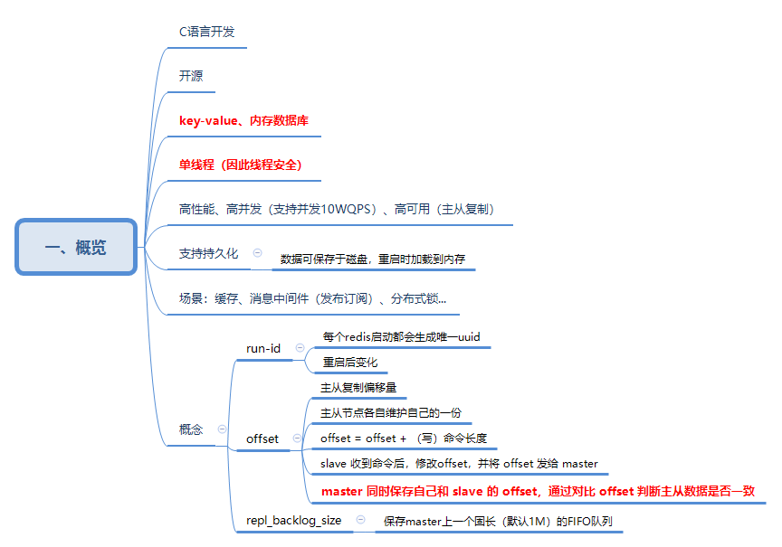

# 概览

Redis 是使用 C 语言开发的、开源的、key-value 类型的内存数据库系统，常用做缓存、消息中间件（发布订阅）、分布式锁...。
* 单线程：线程安全
* 高性能、高并发（支持并发10WQPS）、高可用（主从复制）
* 支持持久化：数据可保存于磁盘，重启时加载到内存

## 概念
run-id：每个 redis 启动都会生成唯一 uuid，重启后会变化

offset：主从复制偏移量，主从节点各自维护自己的一份（***offset = offset + （写）命令长度***）。slave 收到命令后，修改offset，并将 offset 发给 master。
> master 同时保存自己和 slave 的 offset，通过对比 offset 判断主从数据是否一致

repl_backlog_size：保存 master 上一个固长（默认1M）的 FIFO 队列
