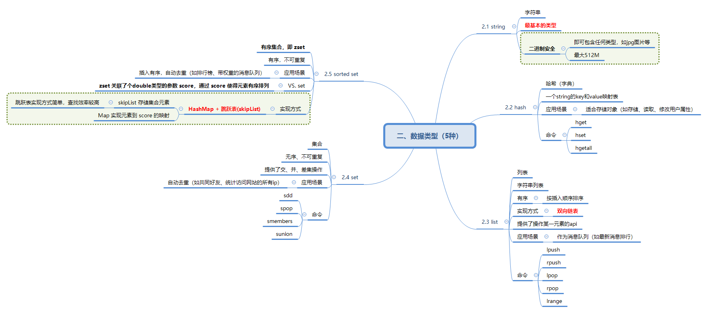

# 数据类型

五种类型：`string + hash + list + set + sorted set`

## string
字符串类型，redis 中**最基本的类型**。string类型是**二进制安全**的，即其 value 可包含任何类型（如jpg图片），最大 512M 大小。

## hash
哈希（字典），是一个 string 的 key-value 映射表。常用语适合存储对象（如存储、读取、修改用户属性）。
> 命令: *hget, hset, hgetall*

## list
列表，是一个使用**双向链表**实现的、有序（按插入顺序排序）字符串列表，常用作消息队列（如最新消息排行）。
> 命令：*lpush, rpush, lpop, rpop, lrange*

## set
集合，是一个无序、不可重复的元素集合, 提供了交、并、差集操作，常用于自动去重（如共同好友、统计访问网站的所有ip）。
> 命令: *sdd, spop, smembers, sunion*

## sorted set
有序集合，即 zset。是一个有序，不可重复的元素集合，常用于插入有序、自动去重（如排行榜、带权重的消息队列）。使用`HashMap + 跳跃表(skipList)`实现。
* skipList 存储集合元素：跳跃表实现方式简单，查找效率较高  
* Map：实现元素到 score 的映射

**zset VS. set**：zset 关联了个 double 类型的参数 score，通过 score 使得元素有序排列。
