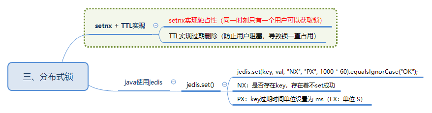

# 分布式锁


可以利用 redis 的 `setnx + TTL` 实现分布式锁功能
* setnx：实现独占锁（实现同一时刻只有一个用户可以操作一个 key）
* TTL：实现过期删除（防止用户阻塞，导致锁一直占用）
* 释放锁: 实现用户操作后立即释放锁（避免用户操作后，还要等待TTL到来，才能释放锁，防止阻塞请求）

> 一般情况，redis key 都是允许覆盖的，即 A、B 用户都可以对某 key(/test) 进行 set 操作


Java 中使用 jedis 来操作 redis。通过 set() 函数来进行分布式锁实现。
```Java
jedis = jedisPool.getResource();

// NX：是否存在key，存在则不set成功  
// PX：key过期时间单位设置为 ms（EX：单位 S）
jedis.set(key, val, "NX", "PX", 1000 * 60).equalsIgnorCase("OK");
```
