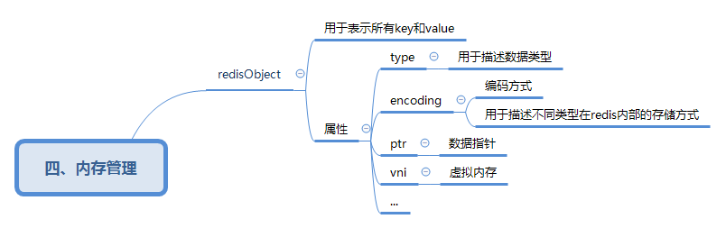

# 内存管理

redis 使用 redisObject 来表示所有 key 和 value。
| 属性     | 描述             | 备注                                  |
| -------- | ---------------- | ------------------------------------- |
| type     | 用于描述数据类型 |                                       |
| encoding | 编码方式         | 用于描述不同类型在redis内部的存储方式 |
| ptr      | 数据指针         |                                       |
| vni      | 虚拟内存         |                                       |
| ...      |                  | TODO                                  | 
