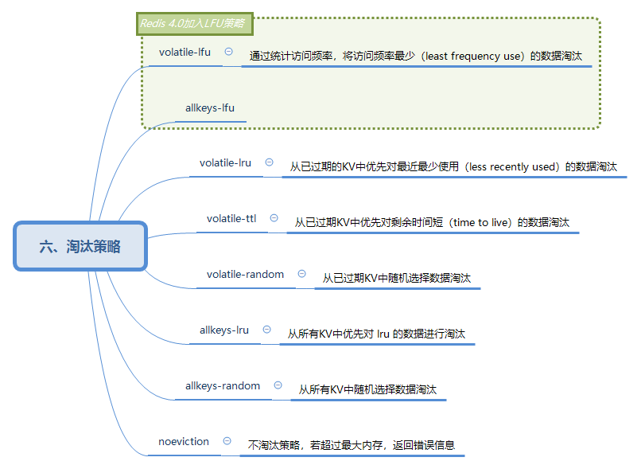

# 淘汰策略

| 策略            | 描述                                                              | 备注           |
| --------------- | ----------------------------------------------------------------- | -------------- |
| volatile-lru    | 从已过期的KV中优先对最近最少使用（less recently used）的数据淘汰  |                |
| volatile-ttl    | 从已过期KV中优先对剩余时间短（time to live）的数据淘汰            |                |
| volatile-random | 从已过期KV中随机选择数据淘汰                                      |                |
| allkeys-lru     | 从所有KV中优先对 lru 的数据进行淘汰                               |                |
| allkeys-random  | 从所有KV中随机选择数据淘汰                                        |                |
| noeviction      | 不淘汰策略，若超过最大内存，返回错误信息                          |                |
| volatile-lfu    | 通过统计访问频率，将访问频率最少（least frequency use）的数据淘汰 | Redis 4.0 支持 |
| allkeys-lfu     |                                                                   | Redis 4.0 支持 | 
