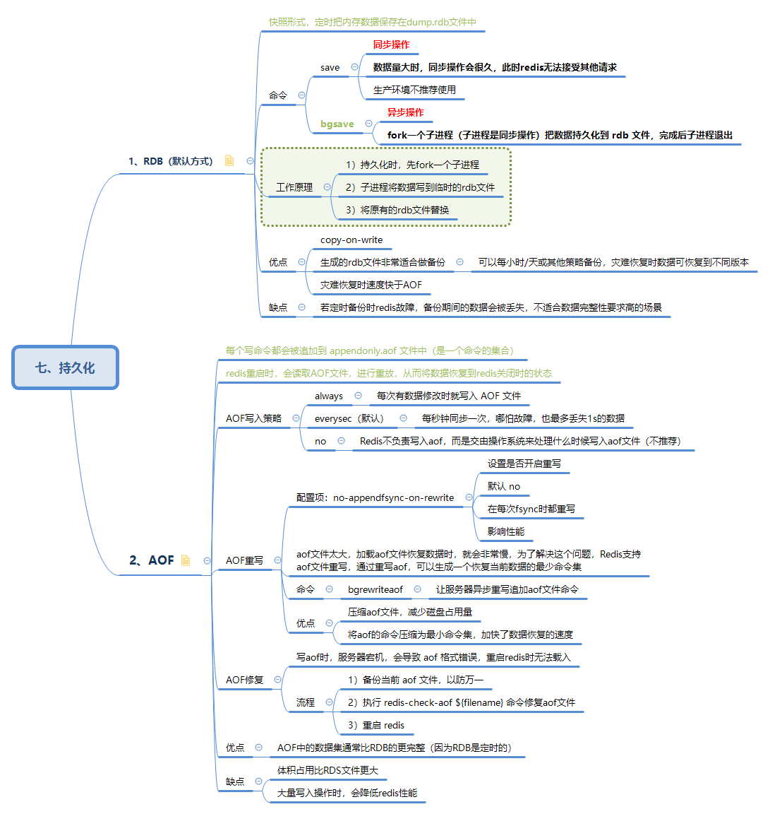

# 持久化


## RDB
在配置文件中使用 save 指定到达触发 RDB 持久化的条件（配置文件方式也是通过 fork 子进程进行持久化处理）
> 不推荐：设置触发的时间太短，则容易频繁写入rdb文件，影响服务器性能，时间设置太长则会造成数据丢失。

```shell
# 900s内至少达到1条写命令
save	900	  1
# 300s内至少达到10条写命令
save	300	  10
# 60s内至少达到10000条写命令
save	60		10000
```

## AOF
```shell
# 开启 AOF
appendfsync	              yes
# 设置目录
dir                       ~/redis/
# 设置文件名
appendfilename            "appendonly.aof"
# 写入策略
appendfsync	              always
# 默认不重写aof文件
no-appendfsync-on-rewrite no
```
